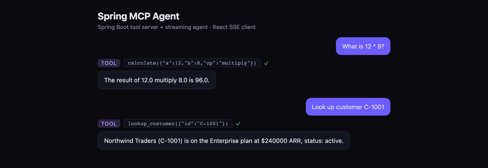

# spring-mcp-agent

A small full-stack demo of an **agentic developer tool**: a Spring Boot (Java 21)
backend that publishes tools over an **MCP-style producer surface** and runs a
**streaming agent** that consumes them, with a **React + TypeScript** front-end that
renders tool calls and tokens in real time over **Server-Sent Events**.

Built to mirror the stack of agentic developer tooling: JVM/Spring Boot backend,
TypeScript/React frontend, MCP producer + consumer, tool/function calling, SSE
streaming, and an OpenAI-compatible endpoint. Runs with **no API key** — the planner
is deterministic — but the LLM seam is isolated in `AgentService` so a real Claude or
OpenAI tool-use call drops straight in.



## Architecture

```
React UI ──EventSource(SSE)──▶ AgentController ─┐
                                                ├─▶ AgentService (plan → invoke → compose)
OpenAI client ──/v1/chat/...──▶ OpenAiCompat ───┘            │
                                                             ▼
External MCP client ──HTTP──▶ McpController ───────▶ ToolRegistry ──▶ Tool beans
   (tools/list, tools/call)        (producer)                         (calculate,
                                                                       lookup_customer,
                                                                       get_weather)
```

`ToolRegistry` is the single source of truth: the same beans are **published** on the
MCP surface (producer) and **invoked** by the agent loop (consumer).

## Endpoints

| Method | Path | Purpose |
| ------ | ---- | ------- |
| `GET`  | `/api/mcp/tools` | Tool discovery (`tools/list`) |
| `POST` | `/api/mcp/tools/{name}/invoke` | Invoke a tool (`tools/call`) |
| `GET`  | `/api/agent/chat?message=…` | Streaming agent turn (SSE: `tool_call` → `tool_result` → `token*` → `done`) |
| `POST` | `/v1/chat/completions` | OpenAI-compatible chat completions (streaming or single JSON) |

## Run it

**Backend** (port 8080):

```bash
mvn spring-boot:run
```

**Frontend** (port 5173):

```bash
cd frontend
npm install
npm run dev
```

Open http://localhost:5173 and try: `What is 12 * 8?`, `Look up customer C-1001`,
`What's the weather in Boulder?`

## Test

```bash
mvn test
```

19 JUnit 5 tests span the tool implementations, the registry, the agent's
planning/composition logic, the MCP controller (including malformed-input
handling), the SSE streaming agent, and the OpenAI-compatible endpoint — the
controllers exercised with MockMvc, including their streaming paths.

## Swapping in a real model

Replace the deterministic `plan()` / `compose()` in
`AgentService` with a Claude tool-use call: pass `ToolRegistry.all()` as the tool
definitions, let the model choose the tool and arguments, invoke via the registry,
and feed the `ToolResult` back for the final message. The streaming controllers and
React client stay exactly as they are.
